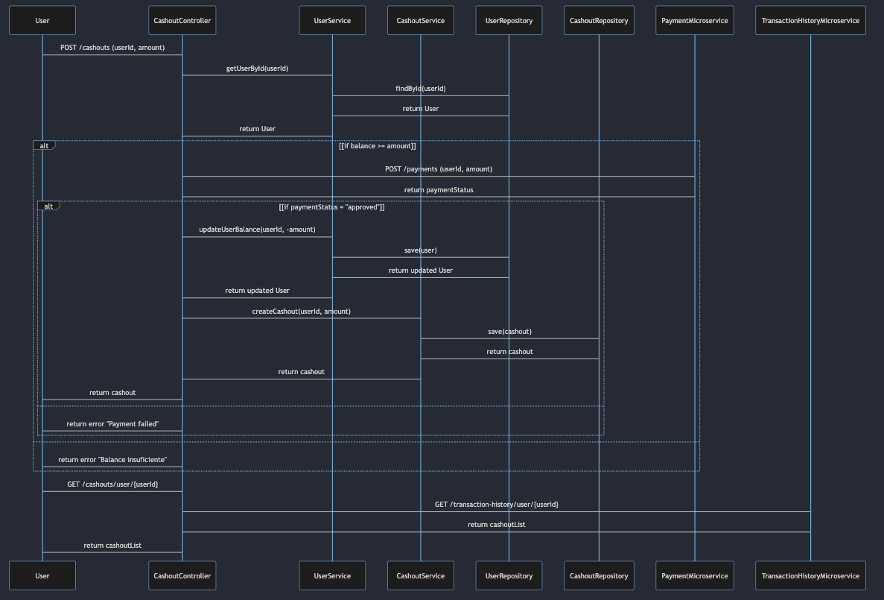

# Proyecto de demostración de Spring WebFlux y Reactive WebClient

Sistema que permite a los usuarios realizar un "cashout", realizando llamadas a otros microservicios desde dos de los endpoints principales. Utilizando persistencia en [mongoDB](https://dev.to/shivamjainn/running-mongodb-locally-with-podman-quick-guide-ogm). 
Igualmente implemente endpoints descritos a continuación:

## Endpoints

### User Endpoints

#### Obtener Usuario por ID
* Método: GET
* URL: /users/{id}
* Entrada: ID del usuario (String)
* Salida: Información del usuario (JSON)
  `{
  "id": 1,
  "name": "John Doe",
  "balance": 100.0
  }`

#### Crear Usuario
* Método: POST
* URL: /users
* Entrada: Información del usuario (JSON)
  `{
  "name": "John Doe",
  "balance": 100.0
  }`
* Salida: Información del usuario (JSON)
  `{
  "id": 1,
  "name": "John Doe",
  "balance": 100.0
  }`

#### Actualizar Balance del Usuario
* Método: PUT
* URL: /users/{id}/balance
* Entrada: Monto a actualizar (JSON)
  `{
  "amount": 50.0
  }`
* Salida: Información del usuario actualizado (JSON)
  `{
  "id": 1,
  "name": "John Doe",
  "balance": 150.0
  }`

## Cashout Endpoints

### Crear Cashout
* Método: POST
* URL: /cashouts
* Entrada: Solicitud de cashout (JSON)
   `{
  "userId": 1,
  "amount": 50.0
  }`
* Salida: Información del cashout creado (JSON)
  `{
  "id": 1,
  "userId": 1,
  "amount": 50.0
  }`

### Obtener Cashouts por ID de Usuario
* Método: GET
* URL: /cashouts/user/{userId}
* Entrada: ID del usuario (String)
* Salida: Lista de cashouts (JSON)
  `[
  {
  "id": 1,
  "userId": 1,
  "amount": 50.0
  },
  {
  "id": 2,
  "userId": 1,
  "amount": 30.0
  }
  ]`

## Diagrama de Secuencia
El diagrama de secuencia a continuación muestra el flujo de las operaciones para un cashout. El usuario inicia solicitando un cashout, el sistema verifica el balance del usuario, realiza la actualización del balance, llama a un microservicio externo de pagos y finalmente crea un registro de cashout.
